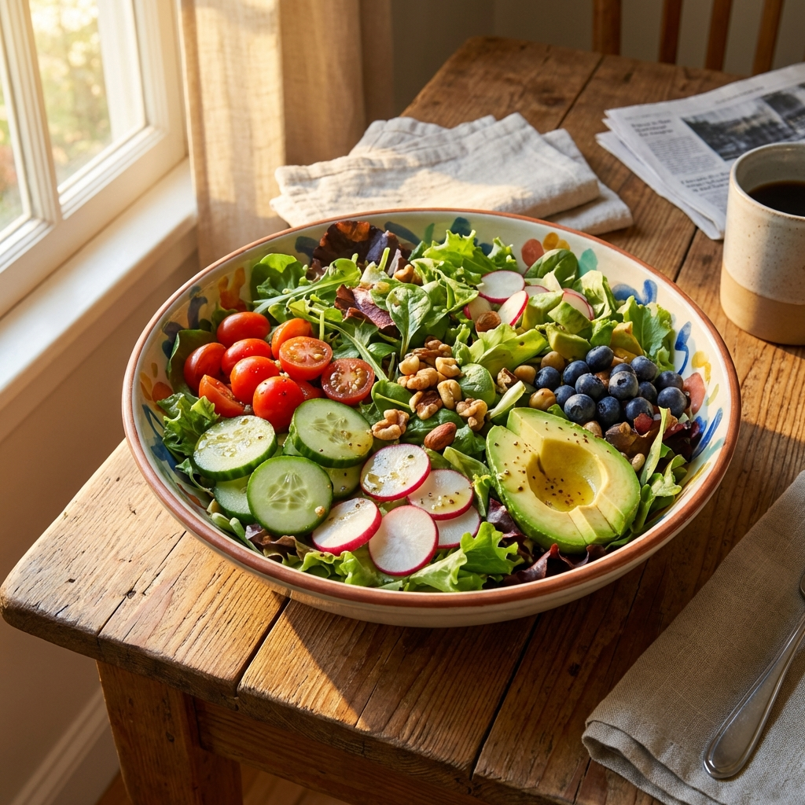

[index.html](https://github.com/user-attachments/files/24725931/index.html)
<!DOCTYPE html>
<html lang="pt-BR">

<head>
    <meta charset="UTF-8">
    <meta name="viewport" content="width=device-width, initial-scale=1.0">
    <meta name="description" content="Emagreça em casa com um método simples, prático e sem academia.">
    <title>Método Simples de Emagrecimento em Casa</title>
    <link rel="preconnect" href="https://fonts.googleapis.com">
    <link rel="preconnect" href="https://fonts.gstatic.com" crossorigin>
    <link href="https://fonts.googleapis.com/css2?family=Inter:wght@400;500;600;700;800&display=swap" rel="stylesheet">
    <link rel="stylesheet" href="./styles.css">
</head>

<body>

    <!-- Hero Section -->
    <header class="hero">
        

            

                <h1>Emagreça em casa com um método simples, prático e sem academia</h1>
                
Perca até 30kg em 30 dias! Um passo a passo para quem quer perder peso mesmo sem
                    tempo e sem dietas malucas.

                <a href="#offer" class="cta-button">Quero emagrecer agora</a>

                

                    

                        MS
                        FO
                        JM
                        +2k
                    

                    

                        
★★★★★

                        
Aprovado por mais de 2.000 alunas

                    

                

            

            

                

                <!-- Floating Message 1 -->
                

                    

                        AS

                    
"Perdi 3kg na primeira semana! ❤️"

                

                <!-- Floating Message 2 -->
                

                    

                        CR

                    
"Método muito prático 👏"

                

                <!-- Floating Message 3 -->
                

                    

                        LM

                    
"Energia a mil! ⚡"

                

                <!-- Floating Message 4 -->
                

                    

                        BP

                    
"Amei os cardápios 🥗"

                

            

        

    </header>

    <!-- Pain Section -->
    <section class="pain">
        

            

                

                    

                        <svg xmlns="http://www.w3.org/2000/svg" width="32" height="32" viewBox="0 0 24 24" fill="none"
                            stroke="currentColor" stroke-width="2" stroke-linecap="round" stroke-linejoin="round">
                            <circle cx="12" cy="12" r="10"></circle>
                            <line x1="15" y1="9" x2="9" y2="15"></line>
                            <line x1="9" y1="9" x2="15" y2="15"></line>
                        </svg>
                    

                    <h3>Tenta emagrecer e não consegue?</h3>
                    
Você até começa animada, corta alguns alimentos, mas a balança parece emperrada. É frustrante
                        sentir que seu esforço não é recompensado e que seu metabolismo parece jogar contra você.

                

                

                    

                        <svg xmlns="http://www.w3.org/2000/svg" width="32" height="32" viewBox="0 0 24 24" fill="none"
                            stroke="currentColor" stroke-width="2" stroke-linecap="round" stroke-linejoin="round">
                            <circle cx="12" cy="12" r="10"></circle>
                            <polyline points="12 6 12 12 16 14"></polyline>
                        </svg>
                    

                    <h3>Sem tempo para academia?</h3>
                    
Sua rotina é corrida, com trabalho, casa e família. Pagar caro numa mensalidade para ir duas
                        vezes no mês não faz sentido. Você precisa de algo que se adapte aos seus horários, não o
                        contrário.

                

                

                    

                        <svg xmlns="http://www.w3.org/2000/svg" width="32" height="32" viewBox="0 0 24 24" fill="none"
                            stroke="currentColor" stroke-width="2" stroke-linecap="round" stroke-linejoin="round">
                            <path
                                d="M10.29 3.86L1.82 18a2 2 0 0 0 1.71 3h16.94a2 2 0 0 0 1.71-3L13.71 3.86a2 2 0 0 0-3.42 0z">
                            </path>
                            <line x1="12" y1="9" x2="12" y2="13"></line>
                            <line x1="12" y1="17" x2="12.01" y2="17"></line>
                        </svg>
                    

                    <h3>Cansada do efeito sanfona?</h3>
                    
Low carb, jejum, sucos... você já tentou de tudo. Até perde alguns quilos, mas ganha tudo de
                        volta em pouco tempo. Você quer uma solução definitiva, sem passar fome e sem dietas malucas.
                    

                

            

            

                <a href="#offer" class="cta-button">Quero emagrecer agora</a>
            

        

    </section>

    <!-- Mid Stats Section -->
    <section class="stats-banner">
        

            

                

                    <h3>+2.000</h3>
                    
Alunas Transformadas

                

                

                    <h3>4.9/5</h3>
                    
Nota de Satisfação

                

                

                    <h3>30 Dias</h3>
                    
Para Ver Resultados

                

            

        

    </section>

    <!-- FAQ Insert 1 -->
    <section class="faq-insert">
        

            

                <h3>❓ Esse método é pra mim?</h3>
                
Se você sente dificuldade em emagrecer por falta de tempo, desmotivação ou excesso de tentativas
                    frustradas, esse método foi criado exatamente para isso.

                
Ele não exige academia, não precisa de equipamentos caros e não depende de dietas extremas. A
                    proposta é simples: constância, passos práticos e aplicação em casa, respeitando o seu ritmo.

                
Mesmo quem está começando do zero consegue seguir, porque tudo é explicado de forma clara e direta.
                

            

        

    </section>

    <!-- Benefits Section -->
    <section class="benefits">
        

            

                <ul class="benefits-list">
                    <li>
                        

                            <svg xmlns="http://www.w3.org/2000/svg" width="20" height="20" viewBox="0 0 24 24"
                                fill="none" stroke="currentColor" stroke-width="3" stroke-linecap="round"
                                stroke-linejoin="round">
                                <polyline points="20 6 9 17 4 12"></polyline>
                            </svg>
                        

                        

                            <h3>Liberdade Total para Treinar</h3>
                            
Realize seus exercícios no conforto da sua sala ou quarto. Adeus trânsito, chuva ou
                                vergonha de academias lotadas.

                        

                    </li>
                    <li>
                        

                            <svg xmlns="http://www.w3.org/2000/svg" width="20" height="20" viewBox="0 0 24 24"
                                fill="none" stroke="currentColor" stroke-width="3" stroke-linecap="round"
                                stroke-linejoin="round">
                                <polyline points="20 6 9 17 4 12"></polyline>
                            </svg>
                        

                        

                            <h3>Zero Equipamentos Necessários</h3>
                            
Esqueça pesos caros ou máquinas complexas. Você usará técnicas inteligentes que utilizam
                                apenas o peso do seu próprio corpo.

                        

                    </li>
                    <li>
                        

                            <svg xmlns="http://www.w3.org/2000/svg" width="20" height="20" viewBox="0 0 24 24"
                                fill="none" stroke="currentColor" stroke-width="3" stroke-linecap="round"
                                stroke-linejoin="round">
                                <polyline points="20 6 9 17 4 12"></polyline>
                            </svg>
                        

                        

                            <h3>Roteiro Passo a Passo</h3>
                            
Um plano à prova de falhas. Você saberá exatamente qual exercício fazer e o que comer em
                                cada dia, sem adivinhações.

                        

                    </li>
                    <li>
                        

                            <svg xmlns="http://www.w3.org/2000/svg" width="20" height="20" viewBox="0 0 24 24"
                                fill="none" stroke="currentColor" stroke-width="3" stroke-linecap="round"
                                stroke-linejoin="round">
                                <polyline points="20 6 9 17 4 12"></polyline>
                            </svg>
                        

                        

                            <h3>Ideal para Iniciantes</h3>
                            
Não importa se você é sedentária ou está parada há anos. O método começa leve e evolui
                                gradualmente com a sua resistência.

                        

                    </li>
                    <li>
                        

                            <svg xmlns="http://www.w3.org/2000/svg" width="20" height="20" viewBox="0 0 24 24"
                                fill="none" stroke="currentColor" stroke-width="3" stroke-linecap="round"
                                stroke-linejoin="round">
                                <polyline points="20 6 9 17 4 12"></polyline>
                            </svg>
                        

                        

                            <h3>Resultados em 30 Dias</h3>
                            
Um desafio focado e direto ao ponto. Com apenas 30 dias de constância, você verá mudanças
                                visíveis no espelho e nas roupas.

                        

                    </li>
                </ul>
                

                    <a href="#offer" class="cta-button">Quero emagrecer agora</a>
                

            

            

                
            

        

    </section>

    <!-- FAQ Insert 2 -->
    <section class="faq-insert">
        

            

                <h3>⏱️ Quanto tempo por dia?</h3>
                
A maioria das pessoas aplica o método em poucos minutos por dia. Não é sobre fazer muito, e sim
                    fazer o básico bem feito, todos os dias.

            

        

    </section>

    <!-- How it Works Section -->
    <section class="how-it-works">
        

            <h2>Como funciona</h2>
            

                

                    
1

                    <h3>Acesso Imediato</h3>
                    
Assim que sua inscrição for confirmada, você recebe um e-mail com login e senha. Em menos de 2
                        minutos você já está dentro.

                

                

                

                    
2

                    <h3>Plano Diário Guiado</h3>
                    
Acesse vídeos curtos e materiais diretos ao ponto. É só dar o play no celular ou na TV e seguir o
                        instrutor passo a passo.

                

                

                

                    
3

                    <h3>Evolução Constante</h3>
                    
Os exercícios queimam gordura sem destruir suas articulações. Faça no seu ritmo e veja a
                        transformação acontecer semana a semana.

                

            

            

                
            

            

                <a href="#offer" class="cta-button">Quero emagrecer agora</a>
            

        

    </section>

    <!-- FAQ Insert 3 -->
    <section class="faq-insert">
        

            

                <h3>📲 Como vou receber o acesso?</h3>
                
Após a compra, o acesso é liberado imediatamente no seu e-mail. Você poderá acessar pelo celular,
                    computador ou tablet, quando quiser.

            

        

    </section>

    <!-- Social Proof Section -->
    <section class="social-proof">
        

            

                <h2>O que dizem nossas alunas</h2>
                
Histórias reais de quem decidiu mudar de vida

            

            

                <!-- Testimonial 1 -->
                

                    

                        
MS

                        

                            <h4>Maria Silva</h4>
                            42 anos
                        

                        

                            <svg xmlns="http://www.w3.org/2000/svg" width="16" height="16" viewBox="0 0 24 24"
                                fill="none" stroke="currentColor" stroke-width="2" stroke-linecap="round"
                                stroke-linejoin="round">
                                <path d="M22 11.08V12a10 10 0 1 1-5.93-9.14"></path>
                                <polyline points="22 4 12 14.01 9 11.01"></polyline>
                            </svg>
                            Verificada
                        

                    

                    
★★★★★

                    
“Eu achava que não tinha tempo, mas as aulas são curtas e direto ao
                        ponto. Perdi 4kg logo na primeira semana! Finalmente algo que funciona pra quem trabalha fora e
                        tem filhos.”

                

                <!-- Testimonial 2 -->
                

                    

                        
FO

                        

                            <h4>Fernanda Oliveira</h4>
                            55 anos
                        

                        

                            <svg xmlns="http://www.w3.org/2000/svg" width="16" height="16" viewBox="0 0 24 24"
                                fill="none" stroke="currentColor" stroke-width="2" stroke-linecap="round"
                                stroke-linejoin="round">
                                <path d="M22 11.08V12a10 10 0 1 1-5.93-9.14"></path>
                                <polyline points="22 4 12 14.01 9 11.01"></polyline>
                            </svg>
                            Verificada
                        

                    

                    
★★★★★

                    
“Depois dos 50, pensei que meu metabolismo tinha parado. Esse método me
                        mostrou que eu estava errada. Voltei a usar calças que não serviam há anos. Me sinto renovada e
                        com muito mais energia!”

                

                <!-- Testimonial 3 -->
                

                    

                        
JM

                        

                            <h4>Juliana Mendes</h4>
                            29 anos
                        

                        

                            <svg xmlns="http://www.w3.org/2000/svg" width="16" height="16" viewBox="0 0 24 24"
                                fill="none" stroke="currentColor" stroke-width="2" stroke-linecap="round"
                                stroke-linejoin="round">
                                <path d="M22 11.08V12a10 10 0 1 1-5.93-9.14"></path>
                                <polyline points="22 4 12 14.01 9 11.01"></polyline>
                            </svg>
                            Verificada
                        

                    

                    
★★★★★

                    
“O melhor investimento que fiz. Sem academia, sem dieta maluca. Só
                        apliquei o passo a passo e o resultado veio mais rápido do que imaginei. As receitas são
                        deliciosas e fáceis!”

                

            

            

                <a href="#offer" class="cta-button">Quero ter esses resultados</a>
            

        

    </section>

    <!-- Final CTA Section (Price) -->
    <section class="final-cta" id="offer">
        

            

                <h2>Oferta Exclusiva</h2>
                

                    De R$ 119,00
                    por apenas
                    R$ 97,00
                

                <ul class="price-checklist">
                    <li>✅ Perca até 30kg em 30 dias</li>
                    <li>✅ Mais disposição no dia a dia</li>
                    <li>✅ Corpo mais leve e definido</li>
                    <li>✅ Nova rotina prática e sem complicação</li>
                </ul>

                <a href="https://pay.kiwify.com.br/dAjV06X?afid=Bx4NNLZ4" class="cta-button large pulse">Comprar agora
                    mesmo</a>
                

                    💳 Cartão de Crédito
                    💠 Pix
                    📄 Boleto
                

            

        

    </section>

    <!-- Footer -->
    <footer>
        

            
Este produto não substitui orientação médica ou nutricional.

            
Resultados variam de pessoa para pessoa.

        

    </footer>

</body>

</html>
